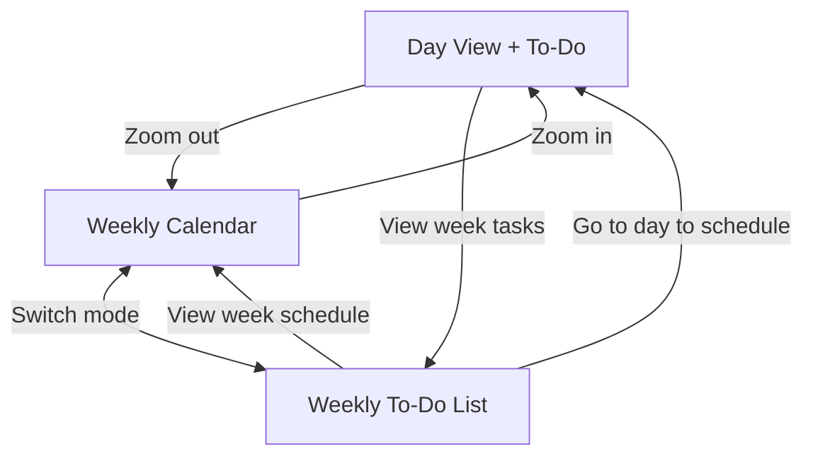
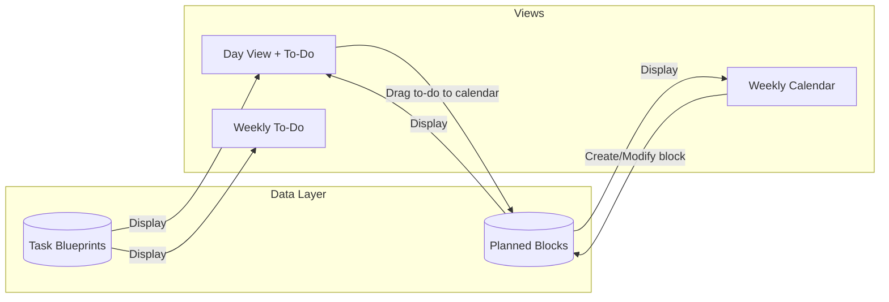
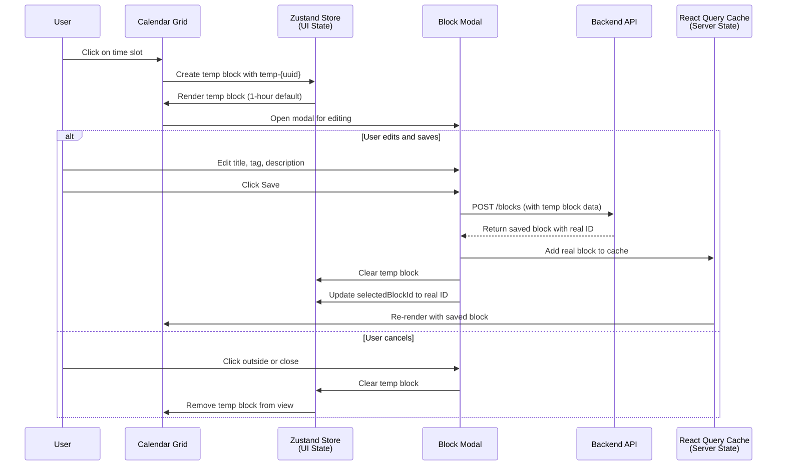

# Calendar Planning Views

## Overview
The calendar planning feature consists of three interconnected views that help users plan their time blocks across different time granularities and formats.

## The Three Views

### 1. Day View with To-Do List (Mixed Calendar Style)
A single-day view that combines:
- **Calendar timeline**: Visual representation of time blocks throughout the day
- **To-do list**: Blueprint/template of tasks for the current day
- **Drag & drop**: Users can drag tasks from to-do list onto the calendar to quickly create planned blocks
- **Task completion**: Users can mark tasks as complete

**Scope**: Single day (e.g., January 10, 2024)

### 2. Weekly To-Do List View
A list-based view showing:
- **Task blueprints** for the week
- **Task management**: View what needs to be done across the week and mark tasks as complete
- **No direct scheduling**: Users must switch to Day View or Weekly Calendar to create blocks from tasks

**Scope**: 7-day period (e.g., Jan 8-14, 2024)

### 3. Weekly Calendar View
A traditional week calendar showing:
- **7-day timeline grid**: All days of the week displayed side-by-side
- **Scheduled blocks**: Visual representation of all planned time blocks
- **Time slots**: Hourly or custom intervals across the week

**Scope**: 7-day period (e.g., Jan 8-14, 2024)

## How the Views Relate to Each Other

### Data Flow

## Block Creation Flow

When a user creates a new block by clicking on the calendar grid, the system follows this flow:

### State Management Architecture

The block creation flow uses a **separation of concerns** between two state management systems:

| State Type | Storage | Purpose | Lifecycle |
|------------|---------|---------|-----------|
| **Temporary Blocks** | Zustand Store | UI-only state for unsaved blocks | Created on click → Cleared on save/cancel |
| **Saved Blocks** | React Query Cache | Server-synchronized state | Persisted after save → Cached from API |

**Key Design Decisions:**
- **Single temp block at a time**: Only one unsaved block can exist (clicking elsewhere discards current temp block)
- **Optimistic updates**: When saving, the block appears immediately before server confirmation
- **Temp IDs**: Format `temp-{uuid}` to distinguish from real server IDs
- **Clean separation**: Temp blocks never touch React Query cache; saved blocks never touch temp storage

## Key Principles for Consistency

### 1. Unified Time Boundaries
All views must respect the same day/week boundary logic:
- **Day boundary**: 00:00:00 to 23:59:59 in user's local timezone
- **Week boundary**: Monday start
- **Block ownership**: A block belongs to the day/week it **starts**, even if it crosses midnight

### 2. Shared Data Model
All three views operate on the same underlying data:

| Entity | Type | Properties | Used By |
|--------|------|------------|---------|
| **Planned Block** | `block_type: "planned"` | start_time, end_time, tag | Day Calendar, Weekly Calendar |
| **Task Blueprint** | Template for quick block creation | title, description, completed, date | Day To-Do, Weekly To-Do |

**Note**: Task blueprints are NOT scheduled. They serve as templates that users can drag to create planned blocks. Tasks can be marked as completed independently of whether blocks were created from them.

### 3. Navigation Consistency
Users should be able to:
- Switch between views while maintaining context (same date/week)
- Drill down: Weekly → Day (click on specific day)
- Zoom out: Day → Weekly (view broader context)
- Toggle mode: Weekly Calendar ↔ Weekly To-Do (same time range, different view)

### 4. Actions Across Views

| Action | Day View | Weekly To-Do | Weekly Calendar |
|--------|----------|--------------|-----------------|
| **Task Actions** |
| Mark task as complete | ✅ Checkbox in to-do list | ✅ Checkbox in list | ❌ Not applicable |
| Create block from task | ✅ Drag from to-do list | ❌ Not supported | ❌ Not applicable |
| **Block Actions** |
| Create new block | ✅ Direct draw on timeline | ❌ Not applicable | ✅ Direct draw on grid |
| Move block | ✅ Drag on timeline | ❌ Not applicable | ✅ Drag on grid |
| Edit block | ✅ Click/modal | ❌ Not applicable | ✅ Click/modal |
| Delete block | ✅ Context menu | ❌ Not applicable | ✅ Context menu |

## Implementation Considerations

### State Synchronization

**Task Completion:**
- When a **task is marked complete** in Day View:
  - Task appears as completed in Weekly To-Do list (if in same week)
  - Completion state persists across views
- When a **task is marked complete** in Weekly To-Do:
  - Task appears as completed in Day View (if viewing that day)

**Block Creation & Updates:**
- When a **task blueprint is dragged** to create a block in Day View:
  - A new planned block is created
  - The task blueprint remains in the to-do list (it's a template, not consumed)
  - Task completion status is independent of block creation
- When a **block is created** in Weekly Calendar:
  - It should appear in Day View (if viewing that day)
- When a **block is modified** in any view:
  - Changes should reflect in all views showing that time range

### Timezone Handling
All views must:
1. Convert user's local time to UTC for storage
2. Convert UTC back to user's local time for display
3. Use the same timezone conversion functions across all views

Reference: See `review_block.md` for timezone conversion logic
