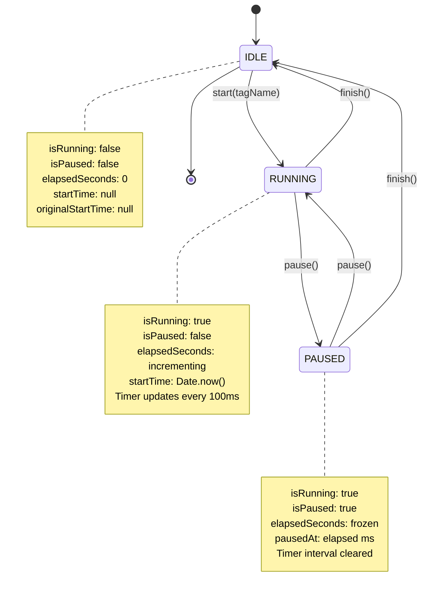

# Focus Timer - State Machine

## Timer States

## State Variables

| Variable | Type | Purpose |
|----------|------|---------|
| `isRunning` | boolean | Timer is active |
| `isPaused` | boolean | Timer is paused (only if running) |
| `elapsedSeconds` | number | Display time (excludes pauses) |
| `startTime` | number \| null | Adjusted start (for pause/resume) |
| `originalStartTime` | number \| null | Real start (for backend) |
| `pausedAt` | number | Elapsed ms when paused |
