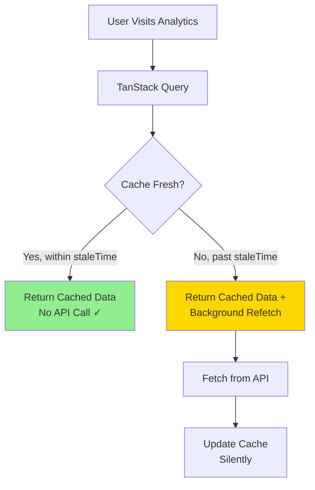

# Analytics Caching Pattern

This document outlines the caching strategy for the Analytics feature using TanStack Query to minimize unnecessary API calls while ensuring data freshness.

## Table of Contents

1. [Current Problem](#current-problem)
2. [Recommended Solution: TanStack Query](#recommended-solution-tanstack-query)
3. [Implementation Overview](#implementation-overview)
4. [Configuration Strategy](#configuration-strategy)
5. [Cache Invalidation](#cache-invalidation)
6. [Expected Benefits](#expected-benefits)

## Current Problem

### Issue: Unnecessary API Calls

Every time users navigate to analytics, the API is called even if they visited seconds ago:

```
Visit 1 (12:00:00) → API called
Visit 2 (12:00:05) → API called again ❌
Visit 3 (12:00:10) → API called again ❌
```

**Current flow:**
1. Component mounts
2. Load cached data from localStorage (instant UI)
3. **ALWAYS fetch from API** (unnecessary load)
4. Update UI with fresh data
5. Save to localStorage

**What's missing:**
- No TTL (Time To Live) check before fetching
- No staleness detection
- Always fetches regardless of cache freshness

## Recommended Solution: TanStack Query

### Why TanStack Query?

TanStack Query is the industry standard for server state management with built-in caching, automatic background refetching, and excellent developer experience.

| Feature | Custom Hook | TanStack Query |
|---------|-------------|----------------|
| Bundle Size | ~0KB | ~13KB gzipped |
| Caching | Manual implementation | Built-in, battle-tested |
| TTL/Staleness | Custom logic needed | Automatic |
| Background Refetch | Custom implementation | Automatic |
| DevTools | None | Full DevTools support |
| Request Deduplication | No | Yes |
| Optimistic Updates | Manual | Built-in |
| Prefetching | No | Built-in |
| Error Retry | Manual | Automatic |
| Maintenance | High | Low |

### Architecture



**Key Concepts:**
- **staleTime**: How long data is considered fresh (no refetch)
- **cacheTime**: How long unused data stays in memory
- **refetchOnMount**: Don't refetch if data is still fresh
- **Stale-While-Revalidate**: Show cache + fetch in background

## Implementation Overview

### Step 1: Install TanStack Query

```bash
npm install @tanstack/react-query
```

### Step 2: Setup Query Provider

```typescript
// src/app/providers.tsx
import { QueryClient, QueryClientProvider } from '@tanstack/react-query';
import { ReactQueryDevtools } from '@tanstack/react-query-devtools';

const queryClient = new QueryClient({
  defaultOptions: {
    queries: {
      staleTime: 5 * 60 * 1000,      // 5 minutes
      cacheTime: 60 * 60 * 1000,     // 1 hour
      refetchOnWindowFocus: false,
      refetchOnMount: false,
      retry: 1,
    },
  },
});

export function Providers({ children }: { children: React.ReactNode }) {
  return (
    <QueryClientProvider client={queryClient}>
      {children}
      <ReactQueryDevtools initialIsOpen={false} />
    </QueryClientProvider>
  );
}
```

### Step 3: Create Query Hook

```typescript
// features/analytics/hooks/useOverviewAnalytics.ts
import { useQuery } from '@tanstack/react-query';
import { getOverviewAnalytics } from '../api/analytics';

export function useOverviewAnalytics(month: number, year: number) {
  return useQuery({
    queryKey: ['analytics', 'overview', month, year],
    queryFn: () => getOverviewAnalytics(month, year),
    staleTime: 5 * 60 * 1000,        // Consider fresh for 5 min
    cacheTime: 60 * 60 * 1000,       // Keep in cache for 1 hour
  });
}
```

### Step 4: Use in Component

```typescript
// src/app/app/analytics/page.tsx
export default function AnalyticsPage() {
  const now = new Date();
  const { currentMonth, currentYear } = useMonthNavigation(
    now.getMonth(),
    now.getFullYear()
  );

  const {
    data,
    isLoading,
    error,
    isFetching,      // Background refetch indicator
  } = useOverviewAnalytics(currentMonth, currentYear);

  if (error) return <ErrorState error={error} />;
  if (isLoading) return <LoadingState />;

  const { todayData, lifetimeData, streaksData, calendarData, heatmapData } = data;

  return (
    <div className="flex-1 h-full bg-background p-6 md:p-8 overflow-y-auto">
      {/* Show subtle indicator during background refetch */}
      {isFetching && <RefetchIndicator />}

      <TodaysWorkSection data={todayData} />
      <StatsSection lifetimeData={lifetimeData} streaksData={streaksData} />
      <CalendarHeatmap data={calendarData} heatmapData={heatmapData} />
    </div>
  );
}
```

## Configuration Strategy

### Recommended TTL Values

Different data types have different freshness requirements:

```typescript
// features/analytics/config/queryConfig.ts
export const ANALYTICS_QUERY_CONFIG = {
  // Today's data changes frequently
  TODAY: {
    staleTime: 2 * 60 * 1000,      // 2 minutes
    cacheTime: 15 * 60 * 1000,     // 15 minutes
  },

  // Overview data (today + historical)
  OVERVIEW: {
    staleTime: 5 * 60 * 1000,      // 5 minutes
    cacheTime: 60 * 60 * 1000,     // 1 hour
  },

  // Historical data changes rarely
  HISTORICAL: {
    staleTime: 15 * 60 * 1000,     // 15 minutes
    cacheTime: 2 * 60 * 60 * 1000, // 2 hours
  },
};
```

### Per-Query Configuration

```typescript
export function useOverviewAnalytics(month: number, year: number) {
  const now = new Date();
  const isCurrentMonth = month === now.getMonth() && year === now.getFullYear();

  return useQuery({
    queryKey: ['analytics', 'overview', month, year],
    queryFn: () => getOverviewAnalytics(month, year),
    // Current month: shorter TTL (data changes)
    // Past months: longer TTL (historical, immutable)
    staleTime: isCurrentMonth
      ? ANALYTICS_QUERY_CONFIG.OVERVIEW.staleTime
      : ANALYTICS_QUERY_CONFIG.HISTORICAL.staleTime,
  });
}
```

## Cache Invalidation

### Automatic Invalidation

Invalidate cache when user modifies data:

```typescript
// features/analytics/hooks/useInvalidateAnalytics.ts
import { useQueryClient } from '@tanstack/react-query';

export function useInvalidateAnalytics() {
  const queryClient = useQueryClient();

  const invalidateCurrentMonth = () => {
    const now = new Date();
    queryClient.invalidateQueries({
      queryKey: ['analytics', 'overview', now.getMonth(), now.getFullYear()],
    });
  };

  const invalidateAll = () => {
    queryClient.invalidateQueries({
      queryKey: ['analytics'],
    });
  };

  return { invalidateCurrentMonth, invalidateAll };
}
```

### Usage After Mutations

```typescript
// When user creates/updates/deletes time blocks
import { useMutation, useQueryClient } from '@tanstack/react-query';

export function useUpdateBlock() {
  const queryClient = useQueryClient();

  return useMutation({
    mutationFn: (data) => updateBlockAPI(data),
    onSuccess: () => {
      // Automatically invalidate related queries
      queryClient.invalidateQueries({ queryKey: ['analytics'] });
    },
  });
}
```

### Invalidation Rules

| User Action | Invalidation Strategy |
|-------------|----------------------|
| Create time block | Invalidate current month analytics |
| Update time block | Invalidate affected month(s) |
| Delete time block | Invalidate affected month(s) |
| Navigate to different month | No invalidation (use cache) |
| Manual refresh | Invalidate current view |

## Expected Benefits

### Performance Improvements

| Metric | Before | After | Improvement |
|--------|--------|-------|-------------|
| **API calls per session** | 10+ | 2-3 | 70-80% reduction |
| **Time to interactive** | 500ms+ | <50ms | 10x faster |
| **Network transfer** | 500 KB | 100-150 KB | 70% reduction |
| **Loading states** | Every visit | Once per 5min | Much better UX |

### Developer Experience

- **DevTools**: Visual query inspector, cache explorer
- **Request Deduplication**: Multiple components requesting same data = 1 API call
- **Automatic Retries**: Built-in error retry with exponential backoff
- **Background Refetch**: Keep UI responsive during updates
- **TypeScript Support**: Full type safety out of the box

### Example Cache Behavior

```
User Session (30 minutes):
├── Visit 1 (0:00)  → API call (cache miss)
├── Visit 2 (0:30)  → Cached (fresh, <5min)
├── Visit 3 (2:00)  → Cached (fresh, <5min)
├── Visit 4 (6:00)  → Cached + background refetch (stale)
├── Visit 5 (8:00)  → Cached (fresh from #4 refetch)
└── Visit 6 (20:00) → Cached + background refetch (stale)

Result: 3 API calls instead of 6 (50% reduction)
With 10 visits: 3-4 API calls instead of 10 (70% reduction)
```

## Migration Guide

### Phase 1: Install & Setup (1-2 hours)
1. Install `@tanstack/react-query` and devtools
2. Add `QueryClientProvider` to app
3. Configure default query options

### Phase 2: Migrate Analytics Hook (2-3 hours)
1. Convert `useOverviewAnalytics` to use `useQuery`
2. Remove custom localStorage caching logic
3. Test with DevTools

### Phase 3: Add Invalidation (1-2 hours)
1. Create `useInvalidateAnalytics` hook
2. Integrate with time block mutations
3. Test cache invalidation flows

### Phase 4: Optimize (1-2 hours)
1. Fine-tune TTL values based on usage
2. Add prefetching for adjacent months
3. Monitor with DevTools

**Total effort: 1-2 days**

## File Structure

```
features/analytics/
├── api/
│   └── analytics.ts              # API calls
│
├── config/
│   └── queryConfig.ts            # NEW: TanStack Query config
│
├── hooks/
│   ├── useOverviewAnalytics.ts   # MODIFIED: Use useQuery
│   └── useInvalidateAnalytics.ts # NEW: Invalidation helpers
│
└── types/
    └── index.ts                  # Analytics types
```

## Learning Resources

- [TanStack Query Docs](https://tanstack.com/query/latest/docs/react/overview)
- [TanStack Query Quick Start](https://tanstack.com/query/latest/docs/react/quick-start)
- [Practical React Query](https://tkdodo.eu/blog/practical-react-query) - TkDodo's blog series
- [React Query DevTools](https://tanstack.com/query/latest/docs/react/devtools)

## Summary

**Recommended approach:** Use TanStack Query for analytics caching

**Why:**
- Industry-standard solution with battle-tested caching
- Zero custom implementation needed
- Excellent DevTools and developer experience
- Automatic background refetching and cache management
- Small bundle size impact (~13KB) for massive feature set

**Key Configuration:**
- 5-minute staleTime for current month data
- 15-minute staleTime for historical months
- Automatic invalidation on data mutations
- Stale-while-revalidate pattern for smooth UX

**Expected Results:**
- 70-80% reduction in API calls
- 10x faster time to interactive
- Significantly better user experience
- Easier to maintain and debug
