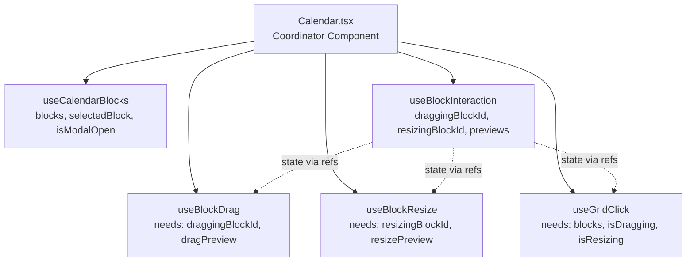
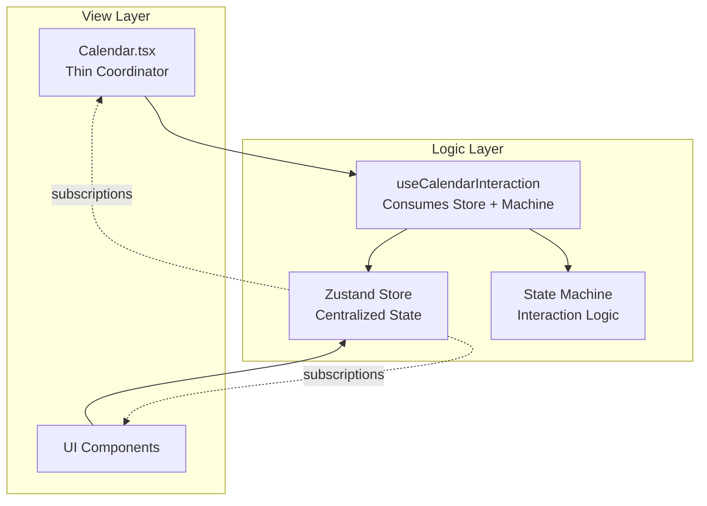
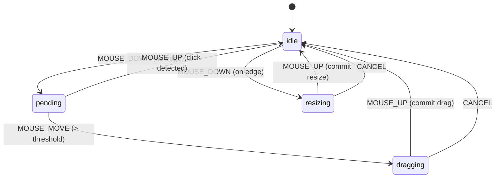

# Architecture Patterns Guide

This document outlines recommended architecture patterns for complex interactive features in HourBloc, using the Calendar feature as a case study. These patterns address common challenges like state coordination, event handling, and component communication.

## Table of Contents

1. [Current Challenges](#current-challenges)
2. [Recommended Pattern: Store + State Machine](#recommended-pattern-store--state-machine)
3. [Pattern 1: Centralized Store (Zustand)](#pattern-1-centralized-store-zustand)
4. [Pattern 2: State Machine for Interactions](#pattern-2-state-machine-for-interactions)
5. [Pattern 3: Thin Coordinator Components](#pattern-3-thin-coordinator-components)
6. [Implementation Guide](#implementation-guide)
7. [When to Use Each Pattern](#when-to-use-each-pattern)
8. [Learning Resources](#learning-resources)

## Current Challenges

The Calendar feature demonstrates several common complexity patterns that arise in interactive React applications:

### State Scattered Across Hooks



**Problems:**
- State lives in multiple hooks, requiring complex coordination
- Hooks need each other's state, leading to prop drilling and ref juggling
- Difficult to understand data flow at a glance

### Ref-Heavy Communication

Current pattern uses refs extensively to share values between hooks:

```typescript
// Current pattern (problematic)
const draggingBlockIdRef = useRef(draggingBlockId);
const dragPreviewRef = useRef(dragPreview);
const blocksRef = useRef(blocks);

useEffect(() => {
  draggingBlockIdRef.current = draggingBlockId;
}, [draggingBlockId]);

// ...repeated for every shared value
```

**Problems:**
- Boilerplate-heavy (6+ refs just for value sharing)
- Easy to forget to update refs
- Mental overhead tracking which values are current

### Callback-via-Ref Pattern

Hooks call each other through ref-stored functions:

```typescript
// Current pattern (complex)
const dragHandlerRef = useRef<(() => void) | null>(null);
const resizeHandlerRef = useRef<(() => void) | null>(null);

useEffect(() => {
  dragHandlerRef.current = handleBlockDrop;
}, [handleBlockDrop]);

// Later, in event handler:
dragHandlerRef.current?.();
```

**Problems:**
- Indirect function calls are hard to trace
- Creates circular dependencies between hooks
- Difficult to debug

## Recommended Pattern: Store + State Machine

The recommended architecture combines three patterns:



**Benefits:**
- Single source of truth for all calendar state
- Declarative interaction logic via state machine
- No refs needed for value sharing
- Thin components that just render

## Pattern 1: Centralized Store (Zustand)

### Why Zustand?

| Feature | React Context | Zustand |
|---------|--------------|---------|
| Re-renders | All consumers on any change | Only affected consumers |
| Selectors | Manual memoization | Built-in |
| Outside React | Not possible | Works anywhere |
| DevTools | Limited | Full support |
| Bundle size | 0 (built-in) | ~1KB |

### Store Structure

```typescript
// features/calendar/store/calendarStore.ts
import { create } from 'zustand';
import { devtools } from 'zustand/middleware';

interface CalendarState {
  // === Data State ===
  blocks: CalendarBlock[];
  selectedBlock: CalendarBlock | null;
  
  // === UI State ===
  isModalOpen: boolean;
  modalPosition: { x: number; y: number } | null;
  
  // === Interaction State ===
  activeBlockId: string | null;
  dragPreview: { dayIndex: number; hour: number } | null;
  resizePreview: { startTime: number; endTime: number } | null;
  
  // === Data Actions ===
  setBlocks: (blocks: CalendarBlock[]) => void;
  addBlock: (block: CalendarBlock) => void;
  updateBlock: (id: string, updates: Partial<CalendarBlock>) => void;
  deleteBlock: (id: string) => void;
  
  // === UI Actions ===
  selectBlock: (block: CalendarBlock | null, position?: { x: number; y: number }) => void;
  closeModal: () => void;
  
  // === Interaction Actions ===
  startInteraction: (blockId: string) => void;
  updateDragPreview: (preview: { dayIndex: number; hour: number } | null) => void;
  updateResizePreview: (preview: { startTime: number; endTime: number } | null) => void;
  commitInteraction: () => void;
  cancelInteraction: () => void;
}

export const useCalendarStore = create<CalendarState>()(
  devtools(
    (set, get) => ({
      // Initial state
      blocks: [],
      selectedBlock: null,
      isModalOpen: false,
      modalPosition: null,
      activeBlockId: null,
      dragPreview: null,
      resizePreview: null,

      // Data actions
      setBlocks: (blocks) => set({ blocks }, false, 'setBlocks'),
      
      addBlock: (block) => set(
        (state) => ({ blocks: [...state.blocks, block] }),
        false,
        'addBlock'
      ),
      
      updateBlock: (id, updates) => set(
        (state) => ({
          blocks: state.blocks.map((b) => 
            b.id === id ? { ...b, ...updates } : b
          ),
          selectedBlock: state.selectedBlock?.id === id 
            ? { ...state.selectedBlock, ...updates } 
            : state.selectedBlock,
        }),
        false,
        'updateBlock'
      ),
      
      deleteBlock: (id) => set(
        (state) => ({
          blocks: state.blocks.filter((b) => b.id !== id),
          selectedBlock: state.selectedBlock?.id === id ? null : state.selectedBlock,
          isModalOpen: state.selectedBlock?.id === id ? false : state.isModalOpen,
        }),
        false,
        'deleteBlock'
      ),

      // UI actions
      selectBlock: (block, position) => set({
        selectedBlock: block,
        isModalOpen: !!block,
        modalPosition: position ?? null,
      }, false, 'selectBlock'),
      
      closeModal: () => set({ 
        isModalOpen: false, 
        selectedBlock: null,
        modalPosition: null,
      }, false, 'closeModal'),

      // Interaction actions
      startInteraction: (blockId) => set(
        { activeBlockId: blockId },
        false,
        'startInteraction'
      ),
      
      updateDragPreview: (preview) => set(
        { dragPreview: preview },
        false,
        'updateDragPreview'
      ),
      
      updateResizePreview: (preview) => set(
        { resizePreview: preview },
        false,
        'updateResizePreview'
      ),
      
      commitInteraction: () => {
        const { activeBlockId, dragPreview, resizePreview, blocks } = get();
        if (!activeBlockId) return;
        
        const block = blocks.find(b => b.id === activeBlockId);
        if (!block) return;
        
        // Apply drag preview
        if (dragPreview) {
          // ... apply drag logic
        }
        
        // Apply resize preview
        if (resizePreview) {
          // ... apply resize logic
        }
        
        set({
          activeBlockId: null,
          dragPreview: null,
          resizePreview: null,
        }, false, 'commitInteraction');
      },
      
      cancelInteraction: () => set({ 
        activeBlockId: null, 
        dragPreview: null, 
        resizePreview: null,
      }, false, 'cancelInteraction'),
    }),
    { name: 'calendar-store' }
  )
);
```

### Using Selectors for Performance

```typescript
// In components - subscribe to specific slices
function CalendarGrid() {
  // Only re-renders when blocks change
  const blocks = useCalendarStore((state) => state.blocks);
  const dragPreview = useCalendarStore((state) => state.dragPreview);
  
  // ...
}

function BlockModal() {
  // Only re-renders when modal state changes
  const { selectedBlock, isModalOpen, closeModal } = useCalendarStore(
    (state) => ({
      selectedBlock: state.selectedBlock,
      isModalOpen: state.isModalOpen,
      closeModal: state.closeModal,
    })
  );
  
  // ...
}
```

## Pattern 2: State Machine for Interactions

### Why State Machines?

Complex interactions have implicit states that are hard to track with booleans:

```typescript
// Current approach (problematic)
const [isDragging, setIsDragging] = useState(false);
const [isResizing, setIsResizing] = useState(false);
const [hasMoved, setHasMoved] = useState(false);

// What if isDragging && isResizing? Invalid state!
// What if hasMoved but not isDragging? Invalid!
```

State machines make states explicit and transitions clear:



### State Machine Implementation

```typescript
// features/calendar/store/interactionMachine.ts

// === State Types ===
type InteractionState = 
  | { type: 'idle' }
  | { type: 'pending'; blockId: string; startPos: { x: number; y: number } }
  | { type: 'dragging'; blockId: string }
  | { type: 'resizing'; blockId: string; edge: 'top' | 'bottom' };

// === Event Types ===
type InteractionEvent =
  | { type: 'MOUSE_DOWN'; blockId: string; position: { x: number; y: number }; edge: 'top' | 'bottom' | null }
  | { type: 'MOUSE_MOVE'; position: { x: number; y: number } }
  | { type: 'MOUSE_UP' }
  | { type: 'CANCEL' };

// === Constants ===
const DRAG_THRESHOLD = 5; // pixels

// === Reducer (Pure Function) ===
export function interactionReducer(
  state: InteractionState, 
  event: InteractionEvent
): InteractionState {
  switch (state.type) {
    case 'idle':
      if (event.type === 'MOUSE_DOWN') {
        if (event.edge) {
          // Direct to resizing when on edge
          return { 
            type: 'resizing', 
            blockId: event.blockId, 
            edge: event.edge 
          };
        }
        // Wait for movement to determine drag vs click
        return { 
          type: 'pending', 
          blockId: event.blockId, 
          startPos: event.position 
        };
      }
      return state;

    case 'pending':
      if (event.type === 'MOUSE_MOVE') {
        const distance = Math.hypot(
          event.position.x - state.startPos.x,
          event.position.y - state.startPos.y
        );
        if (distance > DRAG_THRESHOLD) {
          return { type: 'dragging', blockId: state.blockId };
        }
      }
      if (event.type === 'MOUSE_UP') {
        // No significant movement = this was a click
        return { type: 'idle' };
      }
      if (event.type === 'CANCEL') {
        return { type: 'idle' };
      }
      return state;

    case 'dragging':
      if (event.type === 'MOUSE_UP' || event.type === 'CANCEL') {
        return { type: 'idle' };
      }
      return state;

    case 'resizing':
      if (event.type === 'MOUSE_UP' || event.type === 'CANCEL') {
        return { type: 'idle' };
      }
      return state;

    default:
      return state;
  }
}

// === Helper Functions ===
export function isInteracting(state: InteractionState): boolean {
  return state.type !== 'idle';
}

export function isDragging(state: InteractionState): state is { type: 'dragging'; blockId: string } {
  return state.type === 'dragging';
}

export function isResizing(state: InteractionState): state is { type: 'resizing'; blockId: string; edge: 'top' | 'bottom' } {
  return state.type === 'resizing';
}

export function getActiveBlockId(state: InteractionState): string | null {
  if (state.type === 'idle') return null;
  return state.blockId;
}
```

### Benefits of State Machine

1. **Impossible States are Impossible**: Can't be dragging AND resizing
2. **Easy to Test**: Pure function, no side effects
3. **Self-Documenting**: States and transitions are explicit
4. **Easy to Debug**: Log state transitions to see exactly what happened

## Pattern 3: Thin Coordinator Components

### Before (Current)

```typescript
// Calendar.tsx - 230+ lines, wiring 8 hooks
export default function Calendar() {
  const { blocks, setBlocks, selectedBlock, ... } = useCalendarBlocks();
  const { currentDate, viewMode, datesToShow, ... } = useCalendarNavigation();
  const { handleBlockInteractionStart, draggingBlockId, ... } = useBlockInteraction({...});
  const { handleBlockDrop } = useBlockDrag({...});
  const { handleBlockResizeEnd } = useBlockResize({...});
  const { handleBlockClick } = useBlockClick({...});
  const { handleGridClick } = useGridClick({...});
  
  // Many refs for cross-hook communication
  const dragHandlerRef = useRef<(() => void) | null>(null);
  const resizeHandlerRef = useRef<(() => void) | null>(null);
  
  // Many useEffects to wire handlers
  useEffect(() => { dragHandlerRef.current = handleBlockDrop; }, [handleBlockDrop]);
  useEffect(() => { resizeHandlerRef.current = handleBlockResizeEnd; }, [handleBlockResizeEnd]);
  
  // Complex JSX with many props
  return (/* ... */);
}
```

### After (Recommended)

```typescript
// Calendar.tsx - ~60 lines, thin coordinator
export default function Calendar() {
  const gridRef = useRef<HTMLDivElement>(null);
  
  // Navigation (pure, no side effects)
  const { currentDate, datesToShow, viewMode, navigateDate, goToToday } = 
    useCalendarNavigation();
  
  // Interaction (consumes store internally)
  const { handleBlockMouseDown } = useCalendarInteraction(gridRef, datesToShow);
  
  // UI state from store (no prop drilling)
  const { isModalOpen, selectedBlock, modalPosition, closeModal } = 
    useCalendarStore(state => ({
      isModalOpen: state.isModalOpen,
      selectedBlock: state.selectedBlock,
      modalPosition: state.modalPosition,
      closeModal: state.closeModal,
    }));

  return (
    <div className="flex flex-col h-full">
      <CalendarHeader 
        currentDate={currentDate}
        viewMode={viewMode}
        onNavigate={navigateDate}
        onGoToToday={goToToday}
      />
      
      <DayHeaders dates={datesToShow} viewMode={viewMode} />
      
      <div className="flex flex-1 overflow-hidden">
        <TimeSidebar />
        <CalendarGrid
          ref={gridRef}
          dates={datesToShow}
          onBlockMouseDown={handleBlockMouseDown}
        />
      </div>
      
      {isModalOpen && selectedBlock && (
        <BlockModal 
          block={selectedBlock}
          position={modalPosition}
          onClose={closeModal}
        />
      )}
    </div>
  );
}
```

## Implementation Guide

### Recommended File Structure

```
features/calendar/
├── api/
│   └── blocks.ts                    # API layer (keep as-is)
│
├── store/
│   ├── calendarStore.ts             # Zustand store
│   └── interactionMachine.ts        # State machine reducer
│
├── hooks/
│   ├── useCalendarInteraction.ts    # Consumes store + machine
│   ├── useCalendarNavigation.ts     # Pure navigation logic
│   └── useScrollSync.ts             # Scroll synchronization
│
├── components/
│   ├── Calendar.tsx                 # Thin coordinator
│   ├── CalendarGrid.tsx             # Grid rendering
│   ├── CalendarBlockItem.tsx        # Block rendering
│   ├── CalendarHeader.tsx           # Navigation controls
│   ├── DayHeaders.tsx               # Day labels
│   ├── TimeSidebar.tsx              # Time labels
│   └── BlockModal.tsx               # Edit modal
│
├── types/
│   └── index.ts                     # CalendarBlock, etc.
│
└── utils/
    ├── blockStorage.ts              # localStorage
    ├── gridClick.ts                 # Position calculations
    └── modalPosition.ts             # Modal positioning
```

### Migration Steps

1. **Add Zustand** (if not already installed):
   ```bash
   npm install zustand
   ```

2. **Create the store** (`store/calendarStore.ts`):
   - Move state from `useCalendarBlocks` to store
   - Move interaction state from `useBlockInteraction` to store
   - Add actions for all state mutations

3. **Create the state machine** (`store/interactionMachine.ts`):
   - Define states: idle, pending, dragging, resizing
   - Define events: MOUSE_DOWN, MOUSE_MOVE, MOUSE_UP, CANCEL
   - Implement pure reducer function

4. **Create unified interaction hook** (`hooks/useCalendarInteraction.ts`):
   - Use `useReducer` with state machine
   - Consume store for state updates
   - Handle mouse events in single `useEffect`

5. **Simplify Calendar.tsx**:
   - Remove ref juggling
   - Remove cross-hook wiring
   - Subscribe to store slices

6. **Update components** to consume store directly:
   - `CalendarGrid` subscribes to `blocks`, `dragPreview`
   - `BlockModal` subscribes to `selectedBlock`, `isModalOpen`

## When to Use Each Pattern

### Use Zustand Store When:
- State is shared across multiple components
- State is shared across multiple hooks
- You need to access state outside React (event handlers, utilities)
- You want to avoid prop drilling
- You need DevTools for debugging

### Use State Machine When:
- Interactions have distinct phases (idle → active → complete)
- Invalid state combinations are possible with booleans
- Interaction logic is complex with many conditions
- You need to easily test interaction behavior
- You want self-documenting code

### Keep Custom Hooks When:
- Logic is used in one place only
- Logic has no shared state needs
- Logic is pure computation (like `useCalendarNavigation`)
- Hook encapsulates a single concern

## Comparison Summary

| Aspect | Current Architecture | Recommended Architecture |
|--------|---------------------|-------------------------|
| State location | Scattered across 8 hooks | Centralized in Zustand store |
| State sharing | Refs + prop drilling | Direct store subscription |
| Interaction logic | Imperative in useEffect | Declarative state machine |
| Cross-hook calls | Callback refs | Store actions |
| Calendar.tsx | 230+ lines, heavy coordination | ~60 lines, thin coordinator |
| Testing | Hard (DOM + closures) | Easy (pure reducer function) |
| Debugging | Console.log hunting | DevTools + state transitions |

## Learning Resources

### Essential Reading

1. **Zustand Documentation**  
   https://docs.pmnd.rs/zustand/getting-started/introduction

2. **React useReducer Pattern**  
   https://react.dev/reference/react/useReducer

3. **Finite State Machines in UI**  
   https://statecharts.dev/

4. **XState (advanced state machines)**  
   https://stately.ai/docs

### Recommended Articles

- [Application State Management with React](https://kentcdodds.com/blog/application-state-management-with-react) - Kent C. Dodds
- [Why React Re-Renders](https://www.joshwcomeau.com/react/why-react-re-renders/) - Josh Comeau
- [Stop using isLoading booleans](https://kentcdodds.com/blog/stop-using-isloading-booleans) - Kent C. Dodds

### Video Tutorials

- [Zustand Tutorial](https://www.youtube.com/watch?v=jLcF0Az1nx8) - Jack Herrington
- [State Machines in React](https://www.youtube.com/watch?v=RqTxtOXcv8Y) - Jason Lengstorf

## Summary

The recommended architecture for complex interactive features combines:

1. **Zustand Store** - Single source of truth, eliminates ref juggling
2. **State Machine** - Explicit states, impossible states are impossible
3. **Thin Coordinators** - Components just render, logic lives in store/hooks

This architecture scales well, is easier to test, and provides better developer experience through DevTools and self-documenting code.

