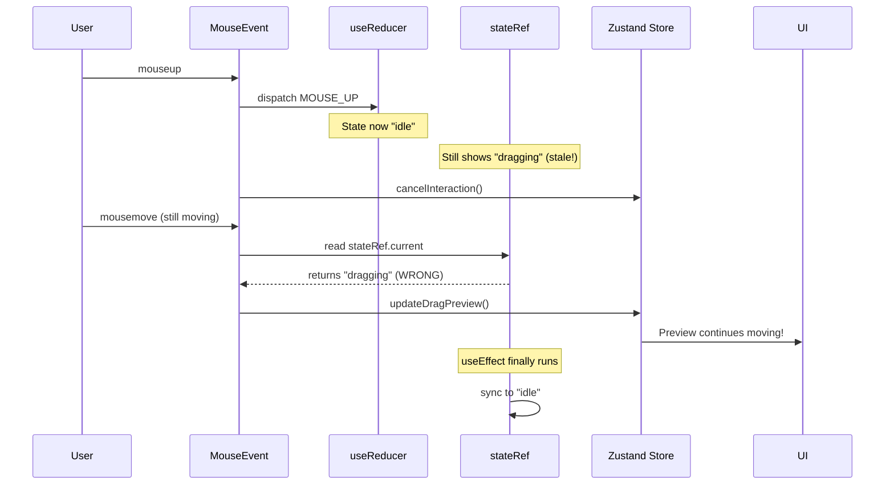
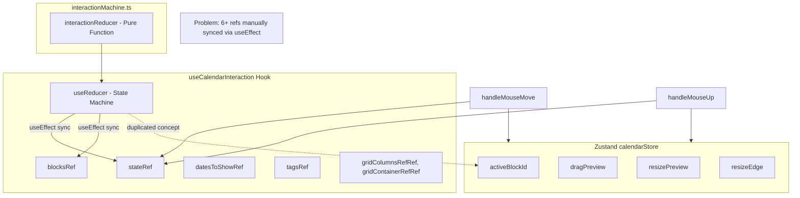
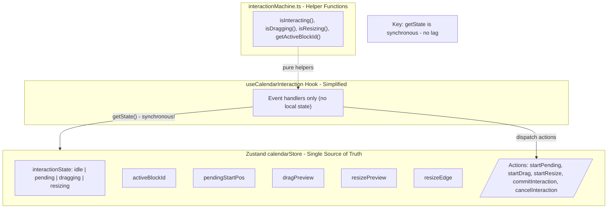
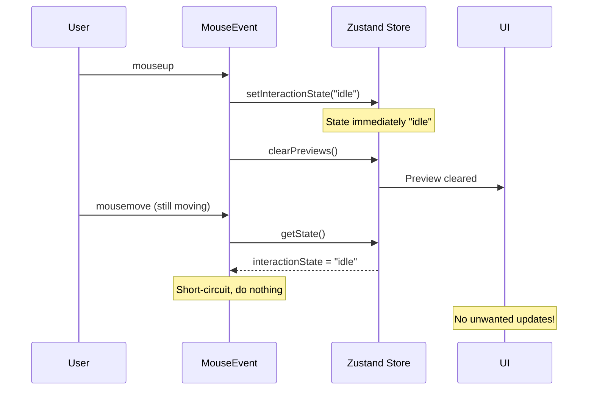

# Interaction State Refactor Plan

This document outlines the high-level approach to fix the drag/resize preview lag issue in the Calendar feature by consolidating interaction state into a single source of truth.

## Table of Contents

1. [Problem Statement](#problem-statement)
2. [Root Cause Analysis](#root-cause-analysis)
3. [Current Architecture](#current-architecture)
4. [Proposed Architecture](#proposed-architecture)
5. [Key Changes Summary](#key-changes-summary)
6. [Files to Modify](#files-to-modify)
7. [Migration Steps](#migration-steps)
8. [Why This Fixes the Issue](#why-this-fixes-the-issue)

## Problem Statement

When dragging or resizing a calendar block, the preview continues to follow mouse movement after the mouse is released. The UI does not immediately reflect the final state, causing a noticeable lag in user experience.

**Symptoms:**
- After releasing the mouse during drag/resize, the preview ghost continues moving
- Block snaps to final position with a delay
- Interaction feels unresponsive and janky

## Root Cause Analysis

The issue stems from **dual state management** with **asynchronous ref synchronization**:

1. **Two state systems managing interaction:**
   - Local `useReducer` in `useCalendarInteraction.ts` tracks `idle | pending | dragging | resizing`
   - Zustand store tracks `activeBlockId`, `dragPreview`, `resizePreview`

2. **Refs used to bridge React's async updates:**
   - `stateRef`, `blocksRef`, `datesToShowRef`, etc. manually sync values
   - Ref updates happen in `useEffect`, which runs AFTER render

3. **Race condition on mouse up:**
   - `dispatch({ type: 'MOUSE_UP' })` updates reducer state
   - `stateRef.current` still holds the OLD state until effect runs
   - Mouse move events fire and read stale `stateRef.current`
   - Preview continues updating even though interaction should be complete



## Current Architecture



**Current pain points:**
- State machine lives in local reducer, previews live in Zustand
- 6+ refs needed to share current values with event handlers
- Ref sync happens in `useEffect` (async), causing stale reads
- Complex mental model: which source of truth is "current"?

## Proposed Architecture



**Benefits:**
- Single source of truth for all interaction state
- No refs needed for value sharing
- `getState()` is synchronous - always returns current value
- Simpler mental model: all state in one place

## Key Changes Summary

### 1. Move Interaction State into Zustand Store

Add to `calendarStore.ts`:
- `interactionState: 'idle' | 'pending' | 'dragging' | 'resizing'`
- `pendingStartPos: { x: number; y: number } | null` (for drag threshold detection)
- Actions: `startPending()`, `startDragging()`, `startResizing()`, etc.

### 2. Remove useReducer from the Hook

In `useCalendarInteraction.ts`:
- Remove `const [state, dispatch] = useReducer(...)`
- Remove all sync refs: `stateRef`, `blocksRef`, `datesToShowRef`, `tagsRef`, `gridColumnsRefRef`, `gridContainerRefRef`
- Remove all `useEffect` that sync refs

### 3. Use getState() in Event Handlers

Replace stale ref reads with synchronous store reads:

**Before (problematic):**
```
const currentState = stateRef.current;  // May be stale!
if (currentState.type === 'dragging') { ... }
```

**After (synchronous):**
```
const { interactionState } = useCalendarStore.getState();  // Always current
if (interactionState === 'dragging') { ... }
```

### 4. Keep State Machine Logic as Helpers

The `interactionMachine.ts` can be:
- Kept as pure helper functions that Zustand actions call, OR
- Inlined directly into Zustand actions

The drag threshold logic and state transition rules remain the same.

## Files to Modify

| File | Changes |
|------|---------|
| `features/calendar/store/calendarStore.ts` | Add `interactionState`, `pendingStartPos`, and transition actions |
| `features/calendar/hooks/useCalendarInteraction.ts` | Remove `useReducer`, remove all refs, use `getState()` in handlers |
| `features/calendar/store/interactionMachine.ts` | Keep as helper functions, or inline into store actions |

## Migration Steps

1. **Add interaction state to Zustand store**
   - Add `interactionState` and `pendingStartPos` to state
   - Add transition actions that encapsulate state machine logic

2. **Update event handlers to use getState()**
   - Replace `stateRef.current` reads with `useCalendarStore.getState()`
   - Replace `blocksRef.current` with `useCalendarStore.getState().blocks`

3. **Remove local reducer and refs**
   - Remove `useReducer` call
   - Remove all `useRef` for sync purposes
   - Remove all `useEffect` that sync refs

4. **Update state machine dispatch calls**
   - Replace `dispatch({ type: 'MOUSE_DOWN', ... })` with store actions
   - Replace `dispatch({ type: 'MOUSE_UP' })` with store actions

5. **Test interaction flow**
   - Verify drag works without lag
   - Verify resize works without lag
   - Verify click-to-open modal still works

## Why This Fixes the Issue

| Current Approach | Proposed Approach |
|-----------------|-------------------|
| `stateRef.current` updated via `useEffect` (async) | `getState()` reads current value (sync) |
| Mouse up → dispatch → wait for React → ref updates | Mouse up → store update → immediate |
| Event handlers see stale state during React batching | Event handlers always see latest state |
| 6+ refs to keep in sync manually | Zero refs needed |

**The key insight:** Zustand's `getState()` is synchronous and always returns the current store value. Unlike React refs that are updated in effects, there is no delay between state change and availability.

When `handleMouseUp` sets `interactionState: 'idle'`, any subsequent `handleMouseMove` call will immediately see `idle` state and short-circuit, preventing the preview lag.



